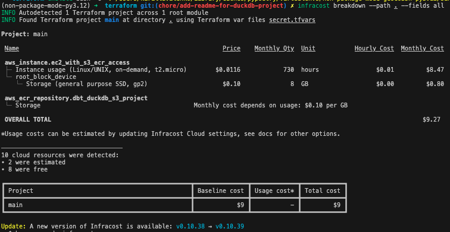
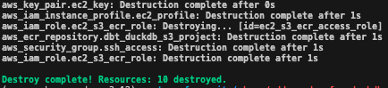

# dbt-duckdb with external S3 materialization

## Overview

This project demonstrates how to use `dbt-duckdb` for data transformations while leveraging S3 as an external storage layer. The goal is to build a scalable and efficient data pipeline that combines DuckDB’s high-performance in-memory processing with the durability and flexibility of S3 for storing large datasets. Transformations can be executed on a local machine, AWS EC2 instance, or any other cloud compute resources, offering a versatile deployment setup.

A key advantage of this setup is using DuckDB as a processing engine while offloading storage to S3, which allows for efficient querying on large datasets that may not fit entirely in memory.

## Why dbt-duckdb with External S3 Materialization?

DuckDB is known for its ability to perform lightning-fast in-memory analytics. Typically, projects using dbt-duckdb rely on a DuckDB database file, which might be stored locally, on `S3`, or via hosted solutions like [Motherduck](https://motherduck.com/). However, in many cases, it makes sense to use `DuckDB` purely as a processing engine while storing data in a shared location such as `S3`.

In this setup, DuckDB handles fast in-memory analytics while using S3 for external materialization, which scales easily for large datasets. This approach allows you to run transformations locally during development and seamlessly scale to the cloud, such as with an `EC2` instance, when running production workloads. By decoupling processing and storage, this setup offers greater flexibility, enabling you to maintain idempotent, resilient pipelines that work consistently across different environments. Whether you are prototyping or deploying in the cloud, this solution ensures efficient, scalable data management.

## Project diagram

The following diagram illustrates the high-level architecture of the solution, showing how dbt, DuckDB, and S3 interact across both local and cloud environments:


## Project setup

### Step 1: Download the NYC Taxi Dataset

Before diving into transformations, we need to download some real-world data for testing. In this project, we’ll be working with the [NYC Taxi & Limousine Commission dataset](https://www.nyc.gov/site/tlc/about/tlc-trip-record-data.page). This data contains trip records of yellow taxis, green taxis, and for-hire vehicles in New York City.

To download the dataset please use  [`../scripts/download_nyc_taxi_data.py`](../scripts/download_nyc_taxi_data.py).


This command will download the yellow taxi trip data for January and February of 2022 and 2023, making it ready for processing in the dbt pipeline:
```bash
python3 download_nyc_taxi_data.py --taxi-types yellow --years 2022,2023 --months 1,2
```

After downloading, you should see files like these in your dataset folder. You can preview a few rows to check the structure and columns.

### Local setup

There are several ways to run this project locally. In this project let's consider two of them:
- using a Python virtual environment
- using containers -  Docker.

#### Using Python Virtual Environment (venv)

A virtual environment allows you to isolate the project’s dependencies from the rest of your system, ensuring that you can manage packages easily without conflicts.

Setup environment:

```bash
python3 -m venv .venv
source .venv/bin/activate
rm requirements-local.txt | exit 0
pip install --upgrade pip pip-tools
pip-compile requirements-local.in 
pip install requirements-local.txt
```

Once the environment is set up, you can run transformations on the data. For example, to run transformations for July 2023:

```bash
dbt build --vars "{"start_date": "2023-07-01"}"
```


After running `tree` command we can see that new files appeared in `../data/processed`:


#### Using Docker:

Docker provides an easy way to run the project in an isolated environment without worrying about local dependency management. All you need is Docker installed on your machine. The same image could be reused to run transformation on a remote server, for example EC2. 

The project includes a Makefile with targets for building and running the Docker image. To build the image, use `make transform-build`.

Once the image is built, you can run the dbt transformations inside the Docker container. Specify the start date as follows: `make transform-run-dbt-project start_date='2023-08-01'` 

### Run in cloud with S3 bucket 

This section will walk you through setting up the necessary infrastructure in AWS using Terraform and running transformations in the cloud.


#### Create a docker image for AMD64 architecture

If you're developing locally on a Mac with an M1 chip, but deploying to an EC2 instance with an AMD64 architecture, you need to build your Docker image for the correct architecture. Use the following command to build the image for the server architecture:

```
make transform-build-linux
```

#### Step 1: Login to AWS Using AWS CLI

Ensure you have the AWS CLI installed and configured with your credentials. Use the following command to log in to your AWS account:

```
aws sso login --sso-session xxxxx
```

#### Step 2: VPC, Subnets and S3 bucket

For this setup, we're reusing an existing VPC and subnets created using the [terraform AWS VPC module](https://registry.terraform.io/modules/terraform-aws-modules/vpc/aws/latest). Also, an existing S3 bucket will be used for this project. These resources are referenced using terraform variables file `secret.tfvars`, which we’ll discuss in the next step.

To copy test data to your S3 bucket, use the following commands:
```
aws s3 cp ../data/raw/nyctaxi/2023/fhvhv_tripdata_2023-01.parquet  s3://your-s3-bucket-name/data/dbt_duckdb/raw/nyctaxi/2023/fhvhv_tripdata_2023-01.parquet
aws s3 cp ../data/raw/nyctaxi/2023/yellow_tripdata_2023-01.parquet  s3://your-s3-bucket-name/data/dbt_duckdb/raw/nyctaxi/2023/yellow_tripdata_2023-01.parquet
aws s3 cp ../data/raw/nyctaxi/2023/green_tripdata_2023-01.parquet  s3://your-s3-bucket-name/data/dbt_duckdb/raw/nyctaxi/2023/green_tripdata_2023-01.parquet
```

#### Step 3: Create a `secret.tfvars` File
Create in `./terraform` folder a `secret.tfvars` file containing your IP address, public key, and relevant AWS resources. This file will be used to configure variables for Terraform.

Here is an example of what `secret.tfvars` should look like:
```
my_ip               = "xxx.xxx.xxx.xxx"
my_public_key       = "~/.ssh/id_rsa.pub"
aws_profile_name    = "your-aws-profile-name"
aws_vpc_name        = "your-vpc-name"
aws_s3_bucket_name  = "your-s3-bucket-name"
```

#### Step 4: Run Terraform Plan

Navigate to the `./terraform` folder and run the following command to generate a terraform plan:

```bash
terraform plan -var-file="secret.tfvars"
```

This command will check the Terraform configuration against the provided variables in secret.tfvars and show you a plan of what resources will be created, modified, or destroyed.

Carefully review the plan to ensure every element of the plan is expected.

Before applying, check the infrastructure costs. On the example below [Infracost](https://www.infracost.io/docs/) is used for this purpose:



#### Step 5: Apply Terraform Configuration

Once you’re satisfied with the plan, run the following command to apply the configuration:

```bash
terraform apply -var-file="secret.tfvars"
```
This will create all the necessary resources, including the EC2 instance, S3 access policy, ECR repository, and security groups.


## Pushing the docker image to ECR

Once the infrastructure is ready, you need to push your Docker image to Amazon ECR (Elastic Container Registry). 

In the terminal run the `aws ecr describe-repositories` to get list of ECR repositories and find repository URL. It will look like 123456789.dkr.ecr.eu-central-1.amazonaws.com.

Log in to your ECR repository:
```
aws ecr get-login-password --region eu-central-1 | docker login --username AWS --password-stdin 123456789.dkr.ecr.eu-central-1.amazonaws.com
```
Tag and push the Docker image to ECR:
```
docker tag dbt_duckdb_s3_project 123456789.dkr.ecr.eu-central-1.amazonaws.com/dbt_duckdb_s3_project:latest
docker push 123456789.dkr.ecr.eu-central-1.amazonaws.com/dbt_duckdb_s3_project:latest
```

## Connecting to EC2 and Running Docker Container

Retrieve your EC2 instance details:
```
aws ec2 describe-instances
```

Connect to your EC2 instance using EC2 public address obtained from the previous step:
```
ssh -i ~/.ssh/id_rsa ec2-user@ec2-3-121-183-186.eu-central-1.compute.amazonaws.com  
```

Once connected, authenticate with ECR and pull the Docker image:
```
aws ecr get-login-password --region eu-central-1 | docker login --username AWS --password-stdin 123456789.dkr.ecr.eu-central-1.amazonaws.com
docker pull 123456789.dkr.ecr.eu-central-1.amazonaws.com/dbt_duckdb_s3_project:latest
```

Run the Docker container and open a bash session inside it:
```
docker container run --network host --rm -it 123456789.dkr.ecr.eu-central-1.amazonaws.com/dbt_duckdb_s3_project:latest bash
```

Inside the container, run the dbt transformation:
```
dbt build --vars "{"start_date": "2023-01-01"}" --target aws
```

Verify the output in your S3 bucket:
```
aws s3 ls your-s3-bucket-name/data/dbt_duckdb/processed/fact_trips/
aws s3 ls your-s3-bucket-name/data/dbt_duckdb/processed/fact_trips/yr=2023/
```


#### Destroy all resources

Remember to clean up resources to avoid unnecessary cloud costs. Running terraform destroy will remove all infrastructure created during the setup.

```
terraform destroy --var-file secret.tfvars
```



## Summary

In this project, we explored how to set up a scalable data pipeline using dbt-duckdb with S3 for external storage. By leveraging the in-memory processing power of DuckDB and the durability of S3, this approach offers flexibility for both local and cloud-based transformations. Whether you're working on a local machine, deploying on EC2, or using any other cloud compute resources, the solution can adapt to different environments seamlessly.
