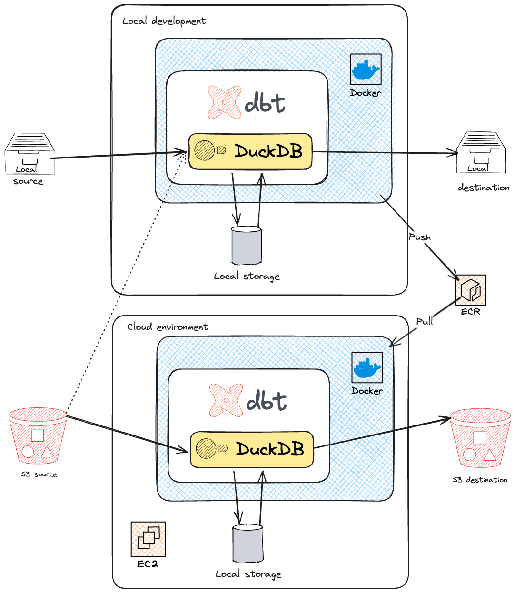

# dbt-duckdb with external S3 materialization

## Overview

This project utilizes dbt-duckdb to perform data transformations and materializations using S3 as an external storage layer. The aim is to build a scalable and efficient data pipeline that leverages the power of DuckDB for in-memory processing while storing large datasets externally in S3. Transformations could be run from local machine and from EC2 instance.

## Project diagram

## Project setup
