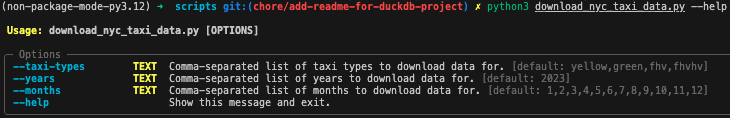

# dbt-duckdb with external S3 materialization

## Overview

This project utilizes dbt-duckdb to perform data transformations and materializations using S3 as an external storage layer. The aim is to build a scalable and efficient data pipeline that leverages the power of DuckDB for in-memory processing while storing large datasets externally in S3. Transformations could be run on a local machine, and also on EC2 instance or any other cloud service.

## Why dbt-duckdb with External S3 Materialization?

DuckDB, known for its ability to perform lightning-fast in-memory analytics, is well-suited for use in modern data pipelines. However, in-memory processing often requires pairing with external storage when dealing with large datasets. By storing the processed data in Amazon S3, we can achieve persistent and scalable storage while keeping processing workloads light and local.

This approach also supports flexibility in deployment, allowing you to run transformations from both your local machine and an EC2 instance in AWS. Whether you're prototyping locally or running production workloads in the cloud, this setup allows you to seamlessly transition between environments.

## Project diagram

The following diagram illustrates the high-level architecture of the solution:


## Project setup

### Step 1: Download the NYC Taxi Dataset

Before diving into transformations, we need to download some real-world data for testing. In this project, we’ll be working with the NYC taxi dataset. This dataset contains trip records of yellow taxis, green taxis, and for-hire vehicles in New York City.

To download the dataset please use  [`../scripts/download_nyc_taxi_data.py`](../scripts/download_nyc_taxi_data.py).




This command will download the yellow taxi trip data for January and February of 2022 and 2023, making it ready for processing in the dbt pipeline:
```bash
python3 download_nyc_taxi_data.py --taxi-types yellow --years 2022,2023 --months 1,2
```

### Local setup

There are several ways to run this project locally. In this project let's consider two of them:
- using a Python virtual environment
- using containers -  Docker.

#### Using Python Virtual Environment (venv)

A virtual environment allows you to isolate the project’s dependencies from the rest of your system, ensuring that you can manage packages easily without conflicts.

Setup environment:

```bash
python3 -m venv .venv
source .venv/bin/activate
rm requirements-local.txt | exit 0
pip install --upgrade pip pip-tools
pip-compile requirements-local.in 
pip install requirements-local.txt
```

Once the environment is set up, you can run transformations on the data. For example, to run transformations for July 2023:

```bash
dbt build --vars "{"start_date": "2023-07-01"}"
```


After running `tree` command we can see that new files appeared in `../data/processed`:


#### Using Docker:

Docker provides an easy way to run the project in an isolated environment without worrying about local dependency management. All you need is Docker installed on your machine. The same image could be reused to run transformation on a remote server, for example EC2. 

The project includes a Makefile with targets for building and running the Docker image. To build the image, use `make transform-build`.

Once the image is built, you can run the dbt transformations inside the Docker container. Specify the start date as follows: `make transform-run-dbt-project start_date='2023-08-01'` 

### Run in cloud with S3 bucket 

This section will walk you through setting up the necessary infrastructure in AWS using Terraform and running transformations in the cloud.


#### Create a docker image for AMD64 architecture

In my case, local development is being done using Macbook with M1 chip, and the EC2 machine will have AMD64 architecture. Therefore docker image need to be assembled for server arch. 

```
make transform-build-linux
```


#### Step 1: Login to AWS Using AWS CLI

Before starting, make sure you have the AWS CLI installed and configured with your AWS credentials. You can log in to your AWS account using:

```
aws sso login --sso-session xxxxx
```

#### Step 2: VPC, Subnets and S3 bucket

Here I'm reusing the existing VPC, subnets and created with a [terraform AWS VPC module](https://registry.terraform.io/modules/terraform-aws-modules/vpc/aws/latest). Also an exiting S3 bucket is used, and terraform code referencing them using variables file `secret.tfvars`, mentioned in the next step.

#### Step 3: Create a secret.tfvars File
Create a secret.tfvars file containing values for your IP and the location of your public key. This file will be used to configure Terraform variables for secure SSH access.

Here is an example of what secret.tfvars should look like:
```
my_ip               = "xxx.xxx.xxx.xxx"
my_public_key       = "~/.ssh/id_rsa.pub"
aws_profile_name    = "your_profile_name"
aws_vpc_name        = "your_vpc_name"
aws_s3_bucket_name  = "your_s3_bucket_name"
```

#### Step 4: Run Terraform Plan

To see what Terraform will create, go to `./terraform` folder and run the following command:

```bash
terraform plan -var-file="secret.tfvars"
```

This command will check the Terraform configuration against the provided variables in secret.tfvars and show you a plan of what resources will be created, modified, or destroyed.

Carefully review the plan to ensure every element of the plan is expected.

#### Step 5: Apply Terraform Configuration

Once you’re satisfied with the plan, run the following command to apply the configuration:

```bash
terraform apply -var-file="secret.tfvars"
```
This will create all the necessary resources, including the EC2 instance, S3 access policy, ECR repository, and security groups.


## Conclusion

